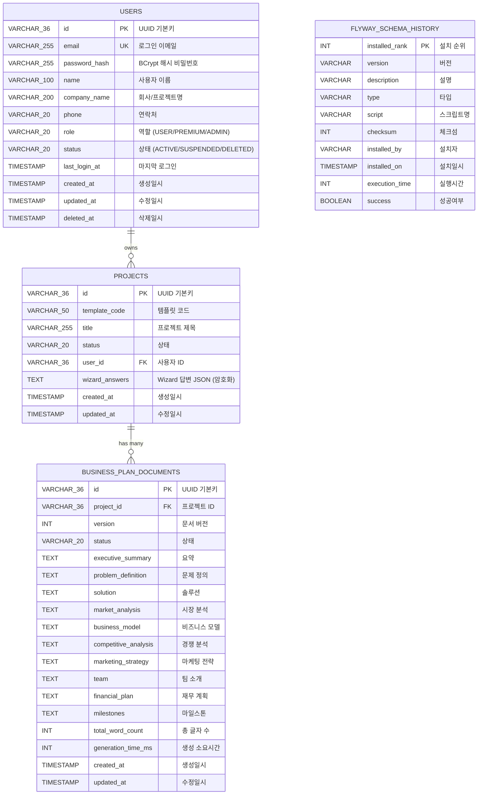

# Database Schema

BizPlan Backend 데이터베이스 스키마 문서입니다.

## ER Diagram



## 테이블 상세

### 1. users

사용자 정보 및 인증을 관리하는 테이블입니다.

| 컬럼명 | 타입 | NULL | 기본값 | 설명 |
|--------|------|------|--------|------|
| `id` | VARCHAR(36) | NO | - | UUID 기본키 |
| `email` | VARCHAR(255) | NO | - | 로그인 이메일 (유니크) |
| `password_hash` | VARCHAR(255) | NO | - | BCrypt 해시 비밀번호 |
| `name` | VARCHAR(100) | YES | NULL | 사용자 이름 |
| `company_name` | VARCHAR(200) | YES | NULL | 회사/프로젝트명 |
| `phone` | VARCHAR(20) | YES | NULL | 연락처 |
| `role` | VARCHAR(20) | NO | 'USER' | 역할 (ENUM) |
| `status` | VARCHAR(20) | NO | 'ACTIVE' | 계정 상태 (ENUM) |
| `last_login_at` | TIMESTAMP | YES | NULL | 마지막 로그인 시간 |
| `created_at` | TIMESTAMP | NO | CURRENT_TIMESTAMP | 생성일시 |
| `updated_at` | TIMESTAMP | NO | CURRENT_TIMESTAMP | 수정일시 |
| `deleted_at` | TIMESTAMP | YES | NULL | 소프트 삭제 시간 |

#### 인덱스

| 인덱스명 | 컬럼 | 용도 |
|----------|------|------|
| `idx_users_email` | email | 로그인 시 이메일 조회 |
| `idx_users_status` | status | 활성 사용자 필터링 |

#### ENUM: UserRole

```java
USER,     // 일반 사용자 - 프로젝트 5개 제한
PREMIUM,  // 프리미엄 사용자 - 무제한
ADMIN     // 관리자 - 모든 권한
```

#### ENUM: UserStatus

```java
ACTIVE,    // 활성 상태
SUSPENDED, // 정지 상태
DELETED    // 삭제 상태 (소프트 삭제)
```

---

### 2. projects

사업계획서 프로젝트를 관리하는 핵심 테이블입니다.

| 컬럼명 | 타입 | NULL | 기본값 | 설명 |
|--------|------|------|--------|------|
| `id` | VARCHAR(36) | NO | - | UUID 기본키 |
| `template_code` | VARCHAR(50) | NO | - | 템플릿 코드 (ENUM) |
| `title` | VARCHAR(255) | YES | NULL | 프로젝트 제목 |
| `status` | VARCHAR(20) | NO | 'DRAFT' | 프로젝트 상태 |
| `user_id` | VARCHAR(36) | YES | NULL | 사용자 ID (향후 FK) |
| `wizard_answers` | TEXT | YES | NULL | Wizard 답변 JSON (AES-256 암호화) |
| `created_at` | TIMESTAMP | NO | CURRENT_TIMESTAMP | 생성일시 |
| `updated_at` | TIMESTAMP | NO | CURRENT_TIMESTAMP | 수정일시 |

#### 인덱스

| 인덱스명 | 컬럼 | 용도 |
|----------|------|------|
| `idx_projects_user_id` | user_id | 사용자별 프로젝트 조회 |
| `idx_projects_status` | status | 상태별 필터링 |
| `idx_projects_template_code` | template_code | 템플릿별 필터링 |

#### ENUM: ProjectStatus

```java
DRAFT,        // 초안 작성 중
IN_PROGRESS,  // Wizard 진행 중
SUBMITTED,    // 제출 완료
APPROVED,     // 승인됨
REJECTED      // 거절됨
```

#### ENUM: TemplateCode

```java
KSTARTUP_2025,       // 예비창업패키지 2025
KSTARTUP_EARLY_2025, // 초기창업패키지 2025
BANK_LOAN_2025,      // 은행 대출용 2025
INVESTOR_PITCH_2025  // 투자유치용 2025
```

---

### 3. business_plan_documents

AI 엔진이 생성한 사업계획서 문서 섹션을 저장합니다.

| 컬럼명 | 타입 | NULL | 기본값 | 설명 |
|--------|------|------|--------|------|
| `id` | VARCHAR(36) | NO | - | UUID 기본키 |
| `project_id` | VARCHAR(36) | NO | - | 프로젝트 FK |
| `version` | INT | NO | 1 | 문서 버전 |
| `status` | VARCHAR(20) | NO | 'DRAFT' | 문서 상태 |
| `executive_summary` | TEXT | YES | NULL | 요약 섹션 |
| `problem_definition` | TEXT | YES | NULL | 문제 정의 섹션 |
| `solution` | TEXT | YES | NULL | 솔루션 섹션 |
| `market_analysis` | TEXT | YES | NULL | 시장 분석 섹션 |
| `business_model` | TEXT | YES | NULL | 비즈니스 모델 섹션 |
| `competitive_analysis` | TEXT | YES | NULL | 경쟁 분석 섹션 |
| `marketing_strategy` | TEXT | YES | NULL | 마케팅 전략 섹션 |
| `team` | TEXT | YES | NULL | 팀 소개 섹션 |
| `financial_plan` | TEXT | YES | NULL | 재무 계획 섹션 |
| `milestones` | TEXT | YES | NULL | 마일스톤 섹션 |
| `total_word_count` | INT | YES | 0 | 총 글자 수 |
| `generation_time_ms` | INT | YES | 0 | AI 생성 소요시간 (ms) |
| `created_at` | TIMESTAMP | NO | CURRENT_TIMESTAMP | 생성일시 |
| `updated_at` | TIMESTAMP | NO | CURRENT_TIMESTAMP | 수정일시 |

#### 인덱스

| 인덱스명 | 컬럼 | 용도 |
|----------|------|------|
| `idx_documents_project_id` | project_id | 프로젝트별 문서 조회 |
| `idx_documents_status` | status | 상태별 필터링 |
| `idx_documents_version` | project_id, version | 버전별 조회 (복합) |

#### 제약조건

| 제약조건명 | 타입 | 설명 |
|------------|------|------|
| `fk_document_project` | FOREIGN KEY | project_id → projects(id), CASCADE DELETE |

#### ENUM: DocumentStatus

```java
GENERATING,  // AI 엔진에서 생성 중
DRAFT,       // 초안 (편집 가능)
REVIEWING,   // 검토 중
FINALIZED,   // 최종 확정
FAILED       // 생성 실패
```

---

### 4. flyway_schema_history

Flyway 마이그레이션 이력을 관리하는 시스템 테이블입니다.

| 컬럼명 | 타입 | 설명 |
|--------|------|------|
| `installed_rank` | INT | PK, 설치 순위 |
| `version` | VARCHAR | 마이그레이션 버전 |
| `description` | VARCHAR | 설명 |
| `type` | VARCHAR | 타입 (SQL, JDBC 등) |
| `script` | VARCHAR | 스크립트 파일명 |
| `checksum` | INT | 체크섬 |
| `installed_by` | VARCHAR | 실행자 |
| `installed_on` | TIMESTAMP | 실행일시 |
| `execution_time` | INT | 실행시간 (ms) |
| `success` | BOOLEAN | 성공 여부 |

---

## 마이그레이션 이력

| 버전 | 파일 | 설명 |
|------|------|------|
| V1 | `V1__create_project_table.sql` | projects 테이블 생성 |
| V2 | `V2__add_wizard_answers_column.sql` | wizard_answers 컬럼 추가 |
| V3 | `V3__create_business_plan_document_table.sql` | business_plan_documents 테이블 생성 |
| V4 | `V4__create_users_table.sql` | users 테이블 생성 (JWT 인증용) |

---

## 보안

### 암호화

- **wizard_answers**: AES-256-GCM 암호화 적용
- JPA `@Convert(converter = EncryptedStringConverter.class)` 사용
- 암호화 키: 환경변수 `ENCRYPTION_KEY`에서 로드

### 접근 제어

- 모든 데이터는 `user_id`를 통해 워크스페이스 단위로 격리
- MVP 단계에서는 기본 사용자 ID 사용

---

## 향후 계획

### Phase 2 (Post-MVP)

1. ~~**users 테이블 추가**~~ ✅ 완료 (V4)
   - 사용자 인증/인가 관리
   - projects.user_id FK 연결

2. **workspaces 테이블 추가**
   - 멀티 워크스페이스 지원
   - 데이터 격리 강화

3. **financial_projections 테이블 추가**
   - 재무 추정 데이터 영구 저장
   - 버전 관리

4. **audit_logs 테이블 추가**
   - 모든 데이터 변경 이력 추적
   - 컴플라이언스 대응

5. **refresh_tokens 테이블 추가**
   - Refresh Token 블랙리스트 관리
   - 다중 디바이스 로그인 지원

